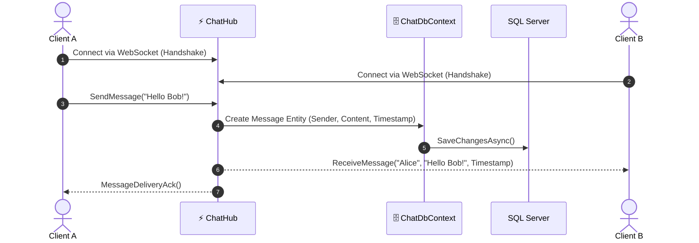

<div align="center">

# ⚡ WebSocket
### Real-Time Full-Duplex Chat & Instant Messaging Engine Built with ASP.NET Core & SignalR

[](https://dotnet.microsoft.com/)
[](https://learn.microsoft.com/en-us/dotnet/csharp/)
[](#-real-time-pipeline)
[](LICENSE)
[](https://github.com/OmarAlfar0uk)

<p align="center">
  <a href="#-key-features">Key Features</a> •
  <a href="#-real-time-pipeline">Real-Time Pipeline</a> •
  <a href="#-tech-stack">Tech Stack</a> •
  <a href="#-getting-started">Getting Started</a> •
  <a href="#-author">Author</a>
</p>

</div>

---

## 📌 Executive Overview

**WebSocket** is a high-performance real-time messaging server engineered with ASP.NET Core, SignalR, and Entity Framework Core. It delivers bidirectional full-duplex communication with persistent chat history, instant group broadcast, user presence detection, and zero-latency message delivery.

> [!NOTE]
> Powered by ASP.NET Core **SignalR Hubs** with database persistence via `ChatDbContext` and Entity Framework Core.

---

## ✨ Key Features

| ⚡ Feature | 💡 Description | 🛠 Engineering Detail |
|---|---|---|
| **🔄 Full-Duplex Messaging** | Instant bi-directional communication between clients | Persistent WebSocket connection with fallback transports |
| **🗄️ Message Persistence** | Real-time chat history stored in relational database | Asynchronous EF Core operations via `ChatDbContext` |
| **👥 Connection Management** | Real-time presence detection and room broadcasting | Managed SignalR Hub connections and group channels |
| **⚡ High Concurrency** | Optimized async/await pipeline for high throughput | Non-blocking asynchronous I/O and low memory allocation |

---

## 🔄 Real-Time Pipeline



---

## ⚡ Tech Stack

| Category | Technology | Purpose |
|---|---|---|
| **Platform** |   | Real-time Web API host |
| **Communication** |  | Real-time full-duplex socket negotiation |
| **Database & ORM**|   | Persistent chat history and message logs |

---

## 🚀 Getting Started

1. **Clone repository:**
   ```bash
   git clone https://github.com/OmarAlfar0uk/WebSocket.git
   cd WebSocket
   ```

2. **Run Application:**
   ```bash
   dotnet run --project WebSocket/WebSocket.csproj
   ```

---

## 👨‍💻 Author

**Omar Alfarouk**  
*Full-Stack .NET & Software Engineer*  

- 🌐 **GitHub:** [@OmarAlfar0uk](https://github.com/OmarAlfar0uk)
- 💼 **LinkedIn:** [omar-alfarouk](https://www.linkedin.com/in/omar-alfarouk-252471251/)
- 📧 **Email:** [omaralfarouk646@gmail.com](mailto:omaralfarouk646@gmail.com)

---

<div align="center">
  <sub>Built with ❤️ by Omar Alfarouk. Licensed under the <a href="LICENSE">MIT License</a>.</sub>
</div>
